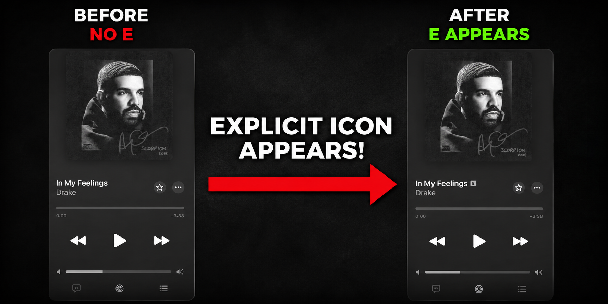

# M4A Advisory Editor



A desktop tool for reviewing and editing iTunes advisory tags in `.m4a` files.

## Features

- Scan one or multiple folders for `.m4a` files
- Recursive and non-recursive folder scanning
- Drag and drop support
- Filter by advisory status: `All`, `Untagged`, `Safe`, `Explicit`
- Set advisory tags quickly:
  - `Safe (0)`
  - `Explicit (1)`
- Cover art preview
- In-app playback attempt with automatic fallback to default system player
- Keyboard shortcuts for fast review workflow

## Requirements

- Python 3.10+
- Windows recommended (best playback support in current implementation)

## Important (Before Using This Tool)

This app is designed for `.m4a` files used in Apple iTunes workflows.
since mp3 files does not support explict tag

If your music is in `.mp3`, convert it first in iTunes:

1. Open iTunes
2. Go to `File`
3. Choose `Convert`
4. Click `Create AAC Version`

After conversion, use the generated AAC/M4A files in this editor.

## Install

```bash
pip install -r requirements.txt
```

## Run

```bash
python main.py
```

## Keyboard Shortcuts

- `Left Arrow`: mark as `Explicit`
- `Right Arrow`: mark as `Safe`
- `Up Arrow`: previous file
- `Down Arrow`: next file
- `Space`: skip file
- `P`: play/pause preview

## Notes

- Playback fallback opens your default media player automatically when in-app MCI playback is unavailable.
- The app uses `icon.png` as the window icon if present in the same folder as `main.py`.

## Support⭐

If this project helps you, please consider giving it a ⭐ on GitHub. It helps more people discover the tool and supports future updates.

## License

This project is licensed under the MIT License. See `LICENSE`.
